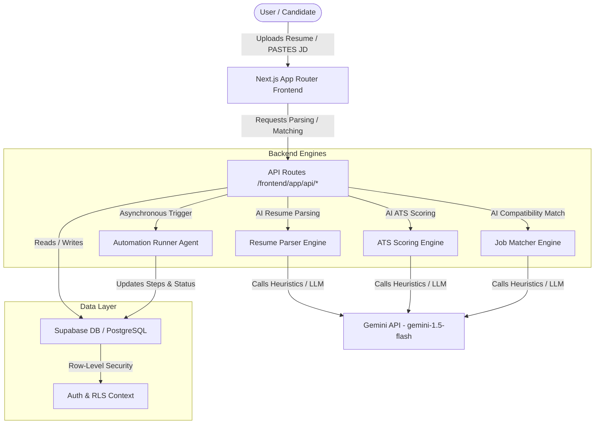

# AutoApply

AutoApply is a next-generation AI-powered job application helper and automation platform. It matches resume profiles against target job requirements, calculates ATS compliance scores, recommends optimizations, and runs asynchronous browser automation agents to submit applications.

---

## Key Features

*   **Resume parsing engine**: Convert raw CV text into structured profiles (headline, skills, bio, history).
*   **ATS scoring optimization**: Instantly calculate compliance score percentage and keyword gaps.
*   **Job matching engine**: Technical compatibility assessment with detailed pros, cons, and customization advice.
*   **Auto-apply agents**: Headless runner automation simulation with real-time logs dashboard.
*   **Application pipeline**: A visual status tracker (Queue, Applied, Interviewing, Offers, Archives).

---

## System Architecture



---

## Repository Structure

```text
AutoApply/
├── frontend/
│   ├── app/
│   ├── components/
│   ├── hooks/
│   ├── lib/
│   ├── types/
│   └── public/
├── backend/
│   ├── supabase/
│   │   ├── migrations/
│   │   ├── functions/
│   │   ├── seed/
│   │   └── policies/
│   ├── ai/
│   ├── automation/
│   └── services/
├── docs/
├── .env.example
├── netlify.toml
├── package.json
├── README.md
└── LICENSE
```

---

## Setup & Local Installation

### Prerequisites
*   Node.js (v18.x or later)
*   NPM
*   Supabase Project (PostgreSQL credentials)
*   Google Gemini API Key

### Installation

1.  Clone the repository:
    ```bash
    git clone https://github.com/Biztarasolutions/AutoApply.git
    cd AutoApply
    ```

2.  Install root dependencies:
    ```bash
    npm install
    ```

3.  Configure your environment variables:
    *   Copy the `.env.example` file to `.env`:
        ```bash
        cp .env.example .env
        ```
    *   Open `.env` and fill in your Supabase connection URLs and your `GEMINI_API_KEY`.
    *   For `DATABASE_URL`, prefer the Supabase **Session Pooler** string when deploying from networks without IPv6 support.

4.  Initialize the database:
    ```bash
    npm run db:init
    ```
    *This runs the migrations, sets up buckets, and seeds mock jobs automatically.*

5.  Launch development environment:
    ```bash
    npm run dev
    ```
    *This starts the Next.js development server on `http://localhost:3000`.*

---

## Database Schema

The database consists of 8 main application tables:
1.  **profiles**: Candidate profile metadata (full name, skills, bio, experience, education).
2.  **resumes**: Candidate CV metadata and text.
3.  **jobs**: Targeted job postings.
4.  **applications**: Job application mapping and status.
5.  **automation_logs**: Step-by-step progress metrics updated by the browser runner.
6.  **ats_scores**: Per-resume and per-job ATS scoring records.
7.  **match_results**: Candidate-to-job matching results.
8.  **notifications**: User-facing notifications and metadata.

All tables are created through `backend/supabase/migrations`, indexed for common lookups, and secured via Row-Level Security (RLS) policies ensuring complete data privacy between candidates.

### Supabase Setup

`npm run db:init` performs the full Supabase bootstrap:

*   Connects using `DATABASE_URL`.
*   Runs every SQL file in `backend/supabase/migrations` in sorted order when the base schema is missing.
*   Creates the private `resumes` and `cover_letters` storage buckets.
*   Applies RLS policies, indexes, and the `on_auth_user_created` trigger.
*   Loads seed jobs from `backend/supabase/seed/seed.sql`.

---

## Deployment Settings

### Netlify Frontend
The application is pre-configured for Netlify deployment via [netlify.toml](netlify.toml).
*   **Base Directory**: `frontend`
*   **Build Command**: `npm run build`
*   **Publish Directory**: `frontend/.next`
*   Ensure all environmental parameters (`DATABASE_URL`, `NEXT_PUBLIC_SUPABASE_URL`, `GEMINI_API_KEY` etc.) are added in Netlify Console settings.

### Supabase Backend
Ensure the DB trigger `on_auth_user_created` and RLS tables are migrated using:
```bash
npm run db:init
```

---

## Git & PR Workflow

1.  Keep both long-running branches available: `main` and `development`.
2.  Commit major features separately with meaningful conventional messages.
3.  Push implementation work to `development`:
    ```bash
    git push origin development
    ```
4.  Open a Pull Request from `development` to `main`.
5.  Merge to `main` only after review and build verification.
