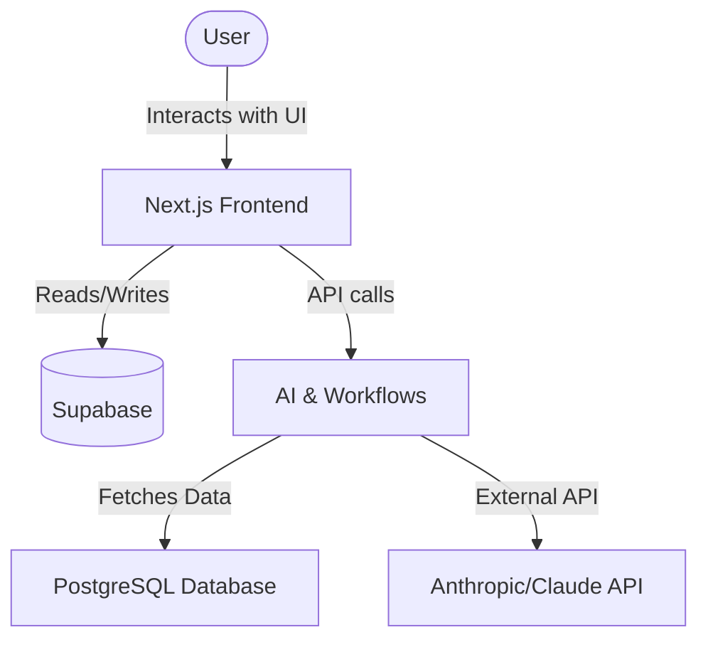

# AutoApply

AutoApply is an AI-powered job application automation platform. It allows users to upload their resumes, matches them with suitable jobs, scores the match using an ATS analyzer, generates tailored cover letters, and tracks the application status through a centralized dashboard.

## Architecture



## Setup Instructions

### 1. Clone the repository
```bash
git clone https://github.com/Biztarasolutions/AutoApply.git
cd AutoApply
```

### 2. Environment Variables
Copy `.env.example` to `.env` and fill in your details:
```
NEXT_PUBLIC_SUPABASE_URL=your_supabase_url
NEXT_PUBLIC_SUPABASE_ANON_KEY=your_supabase_anon_key
SUPABASE_SERVICE_ROLE_KEY=your_supabase_service_key
SUPABASE_DB_PASSWORD=your_db_password
ANTHROPIC_API_KEY=your_anthropic_api_key
JOB_API_KEY=your_job_api_key
NEXT_PUBLIC_APP_URL=http://localhost:3000
NETLIFY_AUTH_TOKEN=your_netlify_token
```

### 3. Supabase Setup
- Create a project on Supabase.
- Go to SQL Editor and run the provided migration in `backend/supabase/migrations/001_initial_schema.sql` (or use `supabase db push` if using CLI).
- Run `backend/supabase/seed/demo.sql` to populate initial demo data.
- Ensure buckets (`resumes`, `cover-letters`, `avatars`) are created as defined in the RLS policies section of the migration script.

### 4. Run the Application
Navigate to the frontend folder, install dependencies, and start the development server.
```bash
cd frontend
npm install
npm run dev
```

## Database Schema Summary
- `profiles`: User information and extracted details.
- `resumes`: Stored resumes and parsed JSON data.
- `ats_scores`: Scores of resumes matched against job descriptions.
- `job_matches`: Found jobs matching user profile.
- `applications`: Tracking of applied jobs and generated cover letters.
- `application_history`: Historical log of application status changes.

## Netlify Deployment
This project uses `netlify.toml` for easy deployment to Netlify. 
- The base directory is set to `frontend`.
- Environment variables must be added in the Netlify site settings.
- Build command is `npm run build` with the publish directory `.next`.
- Redirects are configured to point `/api/*` to Netlify functions or internal routes.

## GitHub Workflow Explanation
- Code is developed on the `development` branch.
- Feature commits follow the `feat: add [feature name]` pattern.
- Pull requests are made from `development` to `main` when a feature or milestone is ready for production.
