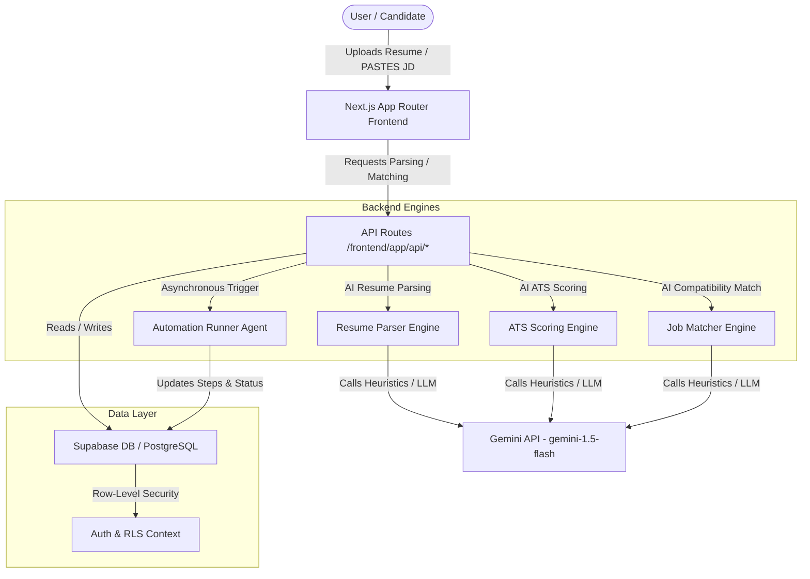

# System Architecture

This document describes the high-level system architecture of the **AutoApply** application.

## System Block Diagram

## Component Breakdown

1. **Frontend Layer (Next.js & Vanilla CSS)**:
   - Dynamic, dark-themed User Interface built with TypeScript.
   - Styled with CSS variables, keyframe animations, and glassmorphism panels.
   - Leverages `lucide-react` for responsive icon representations.

2. **Backend Engine Layer (Node.js)**:
   - **AI Parser (`backend/ai/parser.js`)**: Converts unstructured text inputs into strict schema objects containing candidate contact details, skills, experience arrays, and education details.
   - **ATS Scorer (`backend/ai/ats.js`)**: Matches raw resume inputs against a job description, computing keyword density compliance, reporting gaps, and proposing resume modifications.
   - **Job Matcher (`backend/ai/matcher.js`)**: Evaluates candidate profile attributes against a job posting, outputting rating classifications (Excellent, Good, Fair, Poor), match percentages, pros/cons lists, and tailoring advice.
   - **Automation Agent (`backend/automation/runner.js`)**: Simulated browser agent. It runs through form navigation, text input field filling, document uploads, screener answering, form submission, and submission confirmation validation. Updates the status and step array inside `public.automation_logs` asynchronously.

3. **Database Layer (Supabase / PostgreSQL)**:
   - Schema structure contains: `profiles`, `resumes`, `jobs`, `applications`, and `automation_logs` tables.
   - Row-level security (RLS) protects candidate privacy.
   - Automated triggers setup profiles when users sign up via auth.
