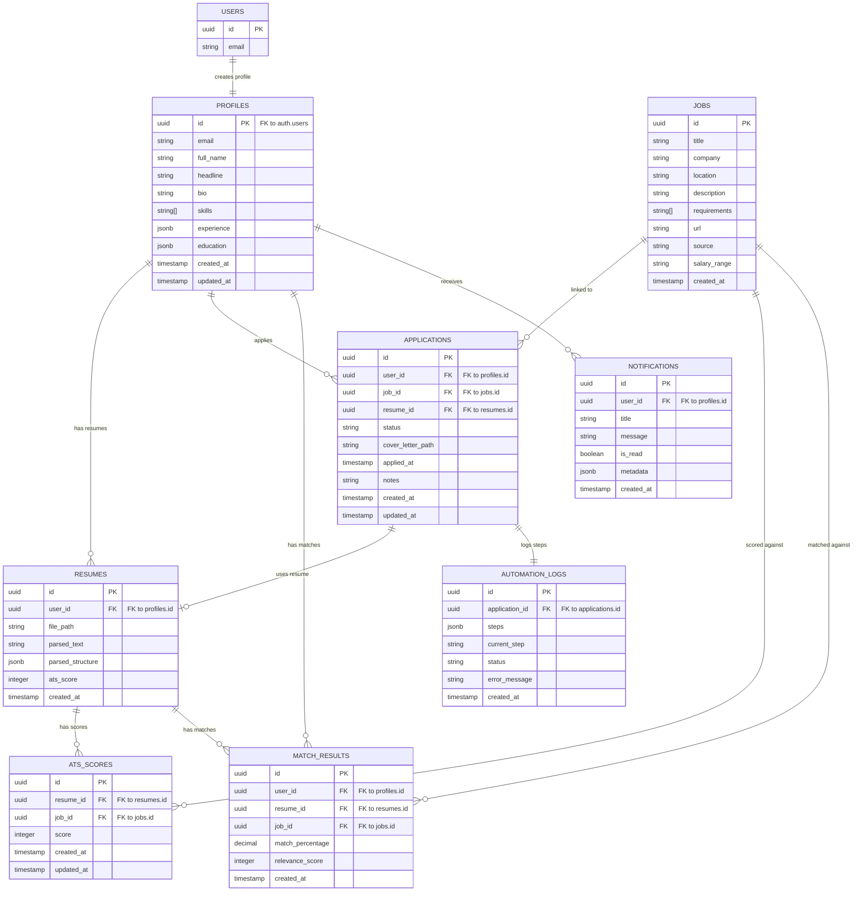

# Database Schema & Security Policies

This document details the Supabase PostgreSQL database tables, relationships, indexes, Row-Level Security (RLS) policies, and database triggers.

## Entity Relationship Diagram



## Security & Policies (RLS)

Row-Level Security (RLS) is enabled on all tables:

1. **Profiles**:
   - `Users can view their own profile`: `auth.uid() = id`
   - `Users can update their own profile`: `auth.uid() = id`
   - `Users can insert their own profile`: `auth.uid() = id`

2. **Resumes**:
   - `Users can view/create/update/delete their own resumes`: `auth.uid() = user_id`

3. **Jobs**:
   - `Anyone authenticated can view jobs`: `auth.role() = 'authenticated'`
   - `Service role can modify jobs`: `true`

4. **Applications**:
   - `Users can view/create/update/delete their own applications`: `auth.uid() = user_id`

5. **Automation Logs**:
   - `Users can view logs of their own applications`: Checks if `application_id` belongs to an application created by the user:
     ```sql
     EXISTS (
         SELECT 1 FROM public.applications
         WHERE public.applications.id = public.automation_logs.application_id
         AND public.applications.user_id = auth.uid()
     )
     ```
   - `Service role can insert/update logs`: `true`

6. **ATS Scores**:
   - Users can view and insert scores linked to resumes they own.

7. **Match Results**:
   - Users can view and insert their own match results.

8. **Notifications**:
   - Users can view, insert, and update their own notifications.

## Performance Indexes

- `idx_resumes_user_id` on `public.resumes(user_id)`
- `idx_applications_user_id` on `public.applications(user_id)`
- `idx_applications_job_id` on `public.applications(job_id)`
- `idx_automation_logs_application_id` on `public.automation_logs(application_id)`
- `idx_ats_scores_resume_id` on `public.ats_scores(resume_id)`
- `idx_ats_scores_job_id` on `public.ats_scores(job_id)`
- `idx_match_results_user_id` on `public.match_results(user_id)`
- `idx_match_results_job_id` on `public.match_results(job_id)`
- `idx_notifications_user_id` on `public.notifications(user_id)`

## Automated Migration Flow

Run `npm run db:init` from the repository root. The script connects through `DATABASE_URL`, checks for the base `profiles` table, and applies all migration files from `backend/supabase/migrations` in sorted order when initialization is needed. It also creates the `resumes` and `cover_letters` storage buckets and loads seed jobs from `backend/supabase/seed/seed.sql`.

## Automation Triggers

### New User Registration Profile Setup
Creates a corresponding profile row in `public.profiles` upon standard registration confirmation.
- **Trigger**: `on_auth_user_created`
- **Hook**: `AFTER INSERT ON auth.users`
- **Function**: `public.handle_new_user()`
