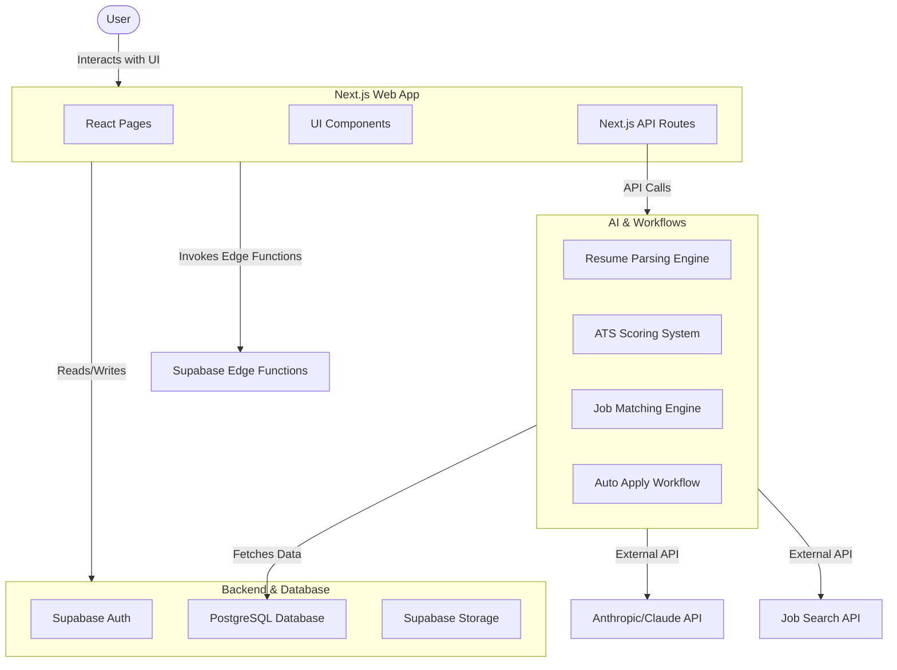

# AutoApply Architecture

## System Architecture

The AutoApply platform is designed as a modern, serverless application utilizing Next.js for the frontend and Supabase for the backend. The core AI functionality is integrated seamlessly to provide resume parsing, ATS scoring, and automated cover letter generation.

## Data Flow
1. **User Authentication:** Handled via Supabase Auth.
2. **Resume Upload:** User uploads a PDF/DOCX to Supabase Storage. The AI parser extracts data and stores it in the `resumes` table.
3. **Job Matching:** Jobs are fetched via external APIs, matched against the parsed resume, and stored in `job_matches`.
4. **ATS Scoring:** A specific job and resume are scored by the AI engine, storing the results in `ats_scores`.
5. **Auto-Apply:** The workflow orchestrates parsing, scoring, generating a tailored cover letter via Claude API, and updating the application status in `applications`.

## Technology Stack
- **Frontend:** Next.js (React), TypeScript, Tailwind CSS
- **Backend:** Supabase (PostgreSQL, Auth, Storage, Edge Functions)
- **AI/LLM:** Anthropic Claude API for deep text understanding and generation
- **Hosting:** Netlify (Frontend), Supabase (Database/Backend)
